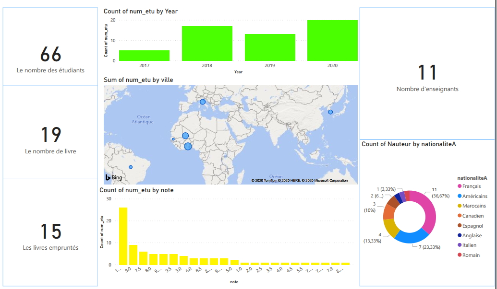
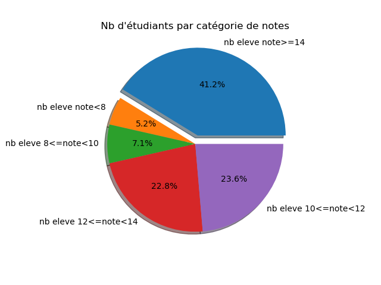
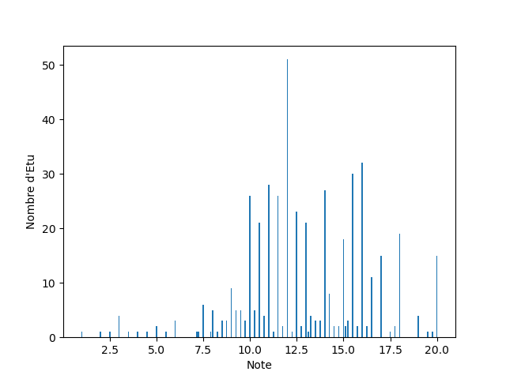

#Students Data-Base Management

Manage a students database, visualize its statistics and create a dashboard using Python, SQlite and Microsoft Power BI Desktop.
***
 ## Goals
  * The relational schema of a database.
  * The use of SQL language through sqlite3.
  * Statistical study using Python language.
 ***
 ## Methods & tools used
 * [Python](https://www.python.org/)
 * [SQlite](https://sqlite.org/)
 * [DB Browser](https://sqlitebrowser.org/)
 * [Power BI Desktop](https://powerbi.microsoft.com/)
 ***
 ## Results in images
   - Dashboard
    
  
 ***
   - Camembert
   
   
 ***
   - Histogram
   
     
   
  ## Closing
  Thank you so much for reading this Project. I truly hope that you enjoyed it.
  
     All advice, comments and pull requests are welcome. For major changes, please open an issue first to discuss what you would like to change.